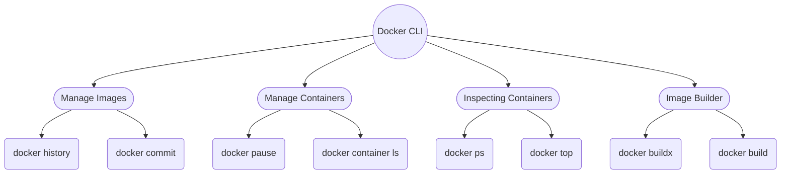

Docker Cheat Sheet

### Table of Contents

[Basic Docker CLIs](#0)

[Container Management CLIs](#1)

[Inspecting the Container](#2)

[Inspecting with Container](#3)

[Image Management Commands](#4)

[Image Transfer Commands](#5)

[Builder Main Commands](#6)

[The Docker CLI](#7)

[Docker Security(Scout,SBOM)](#8)

[Contributors](#9)

[Support and Community](#10)

[References](#11)

### Basic Docker CLIs

|   Command    |           Description            |
| :----------: | :------------------------------: |
|  docker run  | Run a command in a new container |
| docker build |  Build an image from a Dockfile  |
| docker push  |    Push an image to registry     |
| docker pull  |  Pull an image from a registry   |
| docker stop  |     Stop a running container     |
|  docker rm   |  Remove one or more containers   |

 

